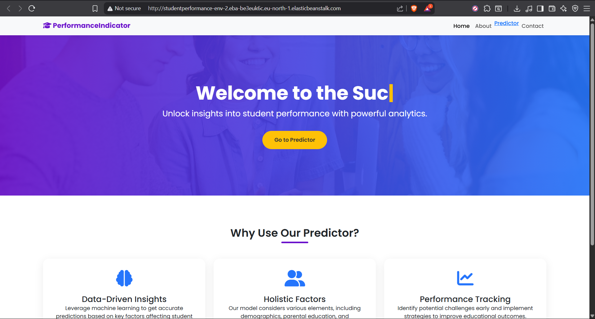
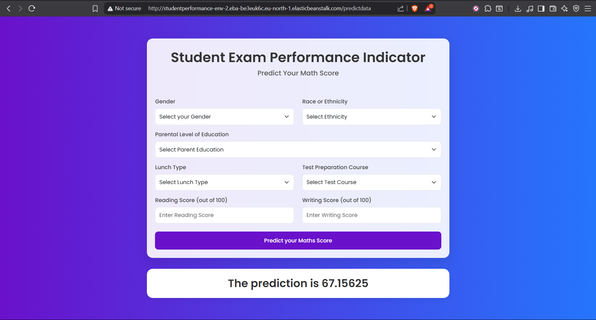
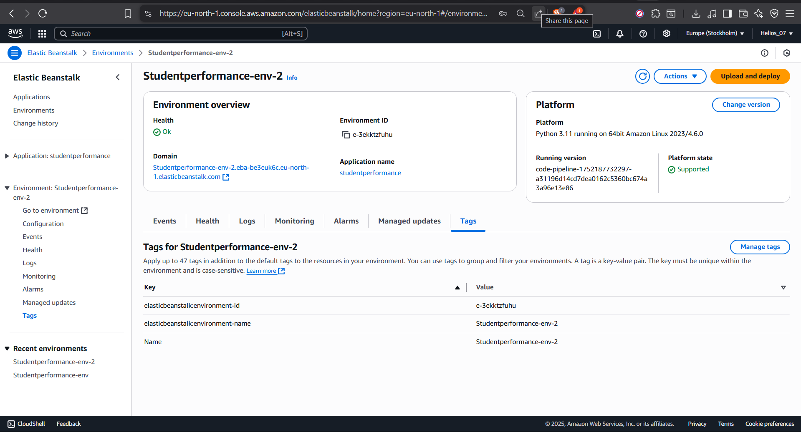
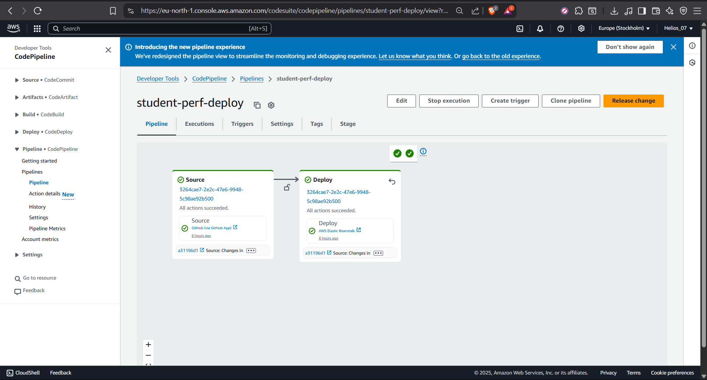

## End to end Machine Learning Project

## 🖼️ Deployment Screenshots

### ✅ Flask App Running on Elastic Beanstalk

---

### 💚 Elastic Beanstalk Health = Green

---

### ⚙️ CodePipeline Success
This pipeline pulls code from GitHub and deploys to Elastic Beanstalk using a ZIP-based workflow.
